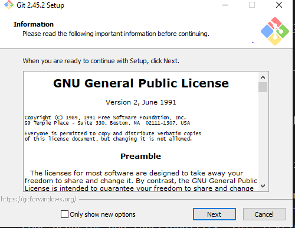

i already had windows 10 installed on my machine. 
i went to https://code.visualstudio.com/Download and downloaded vscode as my IDE .png>)
i went on the setup and installed the program

i went to https://www.git-scm.com/download/win to download git and downloaded the installation package 
then started the installation process 

i then proceeded to download python from http://wwww.python.org/ and downloaded the installation package 

i then proceeded to download mysql on my device and ran the installation file 

i  used my command prompt to install pip on my machine

in my vscode i installed various exrensions to help with code debuging and functionallity 